# CI/CD pipeline reference

This repository uses a small set of GitHub Actions workflows to cover code quality, security scanning, coverage, deployments, and repo automation.
This repository uses GitHub Environments to protect deployment secrets and ensure audit control over network deployments. Shared CI steps for Stellar testnet and pnpm are provided as **reusable workflows** (`workflow_call`) so the main repo, [ILN-Smart-Contract](https://github.com/Invoice-Liquidity-Network/ILN-Smart-Contract), and [ILN-Frontend](https://github.com/Invoice-Liquidity-Network/ILN-Frontend) can reuse the same logic.

## Token permissions (least privilege)

Every workflow declares an explicit top-level `permissions:` block. This overrides the
repository/organization default `GITHUB_TOKEN` scopes and grants each workflow only the
access it actually needs, so a compromised action or dependency cannot escalate beyond the
declared scope.

**Policy**

- **Every** workflow file sets a top-level `permissions:` block — there are no implicit
  defaults. New workflows must add one.
- Start from `contents: read` (or `permissions: {}` when the job touches no repo contents,
  e.g. a pure HTTP probe) and add scopes only where a step demonstrably needs them.
- Prefer a **read-only top-level default** and elevate at the **job level** for the single
  job that needs more (release/publish jobs do this for `contents: write` /
  `id-token: write`). This keeps the elevated scope off every other job in the file.
- Grant `pull-requests: write` only where a bot comments on or opens PRs; `issues: write`
  only where a bot writes issues; `security-events: write` only on the CodeQL analyze jobs;
  `pages: write` + `id-token: write` only for the Pages deploy.

**Scope-by-workflow summary**

| Scope | Workflows |
| ----- | --------- |
| `contents: read` only | `ci` (top-level default), `codeql` (top-level), `coverage`, `e2e`, `e2e-nightly`, `knip`, `pr-title-lint`, `snyk`, `sdk-browser-tests`, `sdk-e2e-local-node`, `docs-deploy` (default), `deploy` (default), `reusable-cache-pnpm`, `reusable-stellar-setup`; read-only top-level default on `release`, `sdk-release`, `scripts-release` |
| `permissions: {}` (none) | `reusable-testnet-health` (HTTP probe only) |
| `contents: write` | `cli-docs`, `docs-changelog` (commit regenerated docs) |
| `contents: write` + `pull-requests: write` | `mainnet-checklist-status` (open checklist PR) |
| `contents: write` + `actions: write` | `coordinate-release` (tag sibling repos, trigger their workflows) |
| `contents: read` + `pull-requests: write` | `ci`, `changeset-check` (comment status on PRs) |
| `security-events: write` (job-level) | `codeql` analyze jobs (upload results) |
| `pages: write` + `id-token: write` (job-level) | `docs-deploy` (OIDC Pages deploy) |
| `contents: write` + `id-token: write` (job-level) | `release`, `sdk-release`, `scripts-release` publish jobs (GitHub Release + npm provenance) |
| `issues: write` | `project-board` (move cards; falls back to `PROJECT_PAT`) |

Reusable workflows (`workflow_call`) also declare `permissions:` — the effective token is
still capped by whatever the **caller** grants, so the declaration documents intent and acts
as a ceiling, never an escalation.

## Pinned action versions (supply-chain)

Every **third-party** action (anything not published by GitHub under `actions/*`) is pinned
to a full 40-character commit SHA, with the human-readable version in a trailing comment:

```yaml
- uses: dorny/paths-filter@d1c1ffe0248fe513906c8e24db8ea791d46f8590 # v3.0.3
```

**Why:** a mutable tag like `@v3` can be force-moved to point at malicious code after we
adopt it; a commit SHA is immutable, so a review of that exact revision stays valid. First-
party `actions/*` actions are trusted and left on major-version tags.

**Currently pinned third-party actions**

| Action | Pinned version |
| ------ | -------------- |
| `pnpm/action-setup` | v4.4.0 |
| `dorny/paths-filter` | v3.0.3 |
| `dorny/test-reporter` | v2.7.0 |
| `codecov/codecov-action` | v5.5.5 |
| `github/codeql-action` (`init` + `analyze`) | v3.37.3 |
| `taiki-e/install-action` | v2.85.1 (with `tool: cargo-llvm-cov`) |
| `softprops/action-gh-release` | v2.6.2 |
| `changesets/action` | v1.9.0 |
| `peter-evans/create-pull-request` | v6.1.0 |
| `dtolnay/rust-toolchain` | `stable` branch @ `2c7215f` (with explicit `toolchain: stable`) |
| `upptime/uptime-monitor` | `master` @ `c540f23` |
| `snyk/actions/setup` | `master` @ `8e119fb` |

Two actions select their behaviour from the ref name, so pinning to a SHA requires passing
that choice as an input instead: `dtolnay/rust-toolchain` gets `toolchain: stable` and
`taiki-e/install-action` gets `tool: cargo-llvm-cov`.

**Keeping SHAs current:** Renovate manages these automatically — `renovate.json` sets
`pinDigests: true` for the `github-actions` manager, so Renovate opens PRs that bump both the
SHA and the version comment when a new release ships. Do not hand-edit SHAs to "latest"; let
Renovate propose the update so the version comment stays accurate. See
[CONTRIBUTING.md](../CONTRIBUTING.md#pinning-third-party-actions) for the contributor policy.

## Reusable workflow templates

| Workflow | File | Purpose |
| -------- | ---- | ------- |
| Stellar setup | `.github/workflows/reusable-stellar-setup.yml` | Install Stellar CLI, configure testnet, create a funded identity |
| pnpm cache | `.github/workflows/reusable-cache-pnpm.yml` | Warm the pnpm store with lockfile-scoped cache keys |
| Testnet health | `.github/workflows/reusable-testnet-health.yml` | Probe Horizon testnet and expose a `healthy` flag |

### `reusable-stellar-setup.yml`

Installs the Stellar CLI via `cargo install`, registers the public testnet endpoints, and generates a funded identity (Friendbot on testnet).

**Inputs**

| Input | Default | Description |
| ----- | ------- | ----------- |
| `identity-name` | `ci-test` | CLI identity alias |
| `network` | `testnet` | Network alias (`stellar network use`) |
| `fund-identity` | `true` | Fund via Friendbot when `true` |
| `horizon-url` | `https://horizon-testnet.stellar.org` | Used for custom testnet registration |
| `rpc-url` | `https://soroban-testnet.stellar.org` | Soroban RPC for testnet registration |
| `network-passphrase` | `Test SDF Network ; September 2015` | Testnet passphrase |
| `stellar-cli-features` | `opt` | Cargo features for `stellar-cli` |

**Outputs**

| Output | Description |
| ------ | ----------- |
| `identity-name` | Identity alias written to the CLI config |
| `public-key` | `G…` address for the identity |
| `network` | Network alias in use |

**Example (same repository)**

```yaml
jobs:
  stellar-setup:
    uses: ./.github/workflows/reusable-stellar-setup.yml
    with:
      identity-name: ci-deployer

  deploy-contract:
    needs: stellar-setup
    runs-on: ubuntu-latest
    steps:
      - uses: actions/checkout@v4
      # Re-install CLI in this job (cached via cargo) or colocate deploy steps in one job.
      - run: echo "Deployer=${{ needs.stellar-setup.outputs.public-key }}"
```

**Example (sibling repository)**

```yaml
jobs:
  stellar-setup:
    uses: Invoice-Liquidity-Network/Invoice-Liquidity-Network/.github/workflows/reusable-stellar-setup.yml@main
    with:
      identity-name: contract-ci
```

> **Note:** Reusable workflows run in an isolated job. The Stellar CLI binary is not available on other runners unless you install it again (cargo install is fast when the cache hits) or keep deploy/test steps in the same callable workflow.

### `reusable-cache-pnpm.yml`

Checks out the repo, restores or populates the pnpm store cache, and optionally runs `pnpm install`. Use it as an early job so later jobs benefit from a warm store when they use the same cache keys.

**Inputs**

| Input | Default | Description |
| ----- | ------- | ----------- |
| `node-version` | `20` | Node.js version |
| `pnpm-version` | `9` | pnpm version |
| `lockfile-path` | `pnpm-lock.yaml` | Lockfile hashed into the cache key |
| `cache-key-prefix` | `iln` | Prefix for `actions/cache` keys |
| `install-dependencies` | `false` | Run `pnpm install` when `true` |
| `install-args` | `--frozen-lockfile` | Arguments for `pnpm install` |

**Outputs**

| Output | Description |
| ------ | ----------- |
| `cache-hit` | `true` when the primary cache key matched |

**Cache key format**

```text
{cache-key-prefix}-{runner.os}-pnpm-{hashFiles(lockfile-path)}
```

Restore key prefix: `{cache-key-prefix}-{runner.os}-pnpm-`

**Example**

```yaml
jobs:
  pnpm-cache:
    uses: ./.github/workflows/reusable-cache-pnpm.yml

  unit-tests:
    needs: pnpm-cache
    runs-on: ubuntu-latest
    steps:
      - uses: actions/checkout@v4
      - uses: ./.github/actions/setup-pnpm
        with:
          install-args: --frozen-lockfile
      - run: pnpm test
```

The composite action [`.github/actions/setup-pnpm`](../.github/actions/setup-pnpm/action.yml) uses the same cache keys as the reusable workflow so caller jobs stay in sync without duplicating YAML.

### Reusable workflow vs composite action — which to use?

This repo provides **two** shared setup mechanisms for pnpm:

| Mechanism | File | Runs as | When to use |
| --------- | ---- | ------- | ----------- |
| Composite action | `.github/actions/setup-pnpm/action.yml` | A step inside a job | Default choice for most jobs. Use when you need pnpm + Node + store cache inside an existing job. |
| Reusable workflow | `.github/workflows/reusable-cache-pnpm.yml` | A separate top-level job | Use when you want to pre-warm the pnpm store in an **early job** so later jobs in the same workflow hit the cache. The reusable workflow calls the composite action internally. |

**Guidelines:**

- Start with the **composite action** (`./.github/actions/setup-pnpm`) unless you have a specific reason to use the reusable workflow.
- Use the **reusable workflow** only when you need a dedicated cache-warming job that runs before multiple downstream jobs.
- Do **not** reimplement pnpm/Node setup inline — always use the shared action or workflow.
- For Stellar CLI setup, use `reusable-stellar-setup.yml` when you need a funded testnet identity; otherwise install the CLI inline with cargo caching.

### `reusable-testnet-health.yml`

Requests `/.well-known/stellar.json` from Horizon and sets `healthy` to `true` when the response contains a valid network passphrase.

**Inputs**

| Input | Default | Description |
| ----- | ------- | ----------- |
| `horizon-url` | `https://horizon-testnet.stellar.org` | Horizon base URL |
| `max-attempts` | `3` | Retry count |
| `retry-delay-seconds` | `5` | Delay between attempts |

**Outputs**

| Output | Description |
| ------ | ----------- |
| `healthy` | `true` or `false` (string) |

**Example — gate testnet integration**

```yaml
jobs:
  testnet-health:
    uses: ./.github/workflows/reusable-testnet-health.yml

  sdk-testnet-integration:
    needs: testnet-health
    if: needs.testnet-health.outputs.healthy == 'true'
    runs-on: ubuntu-latest
    steps:
      - run: pnpm test:integration:testnet
```

When `healthy` is `false`, dependent jobs are skipped and the workflow logs a warning from the health job.

---

## Concurrency groups

Most PR/push-triggered workflows use `concurrency` groups to cancel superseded runs, saving CI minutes:

```yaml
concurrency:
  group: ${{ github.workflow }}-${{ github.ref }}
  cancel-in-progress: true
```

**Workflows with `cancel-in-progress: true`** (safe to cancel — no side effects):

`ci.yml`, `cli-docs.yml`, `cli-smoke.yml`, `coverage.yml`, `e2e.yml`, `codeql.yml`, `snyk.yml`, `knip.yml`, `pr-title-lint.yml`, `changeset-check.yml`, `sdk-api-docs.yml`, `sdk-browser-tests.yml`, `sdk-bundle-size.yml`

**Workflows with `cancel-in-progress: false`** (should not be interrupted):

| Workflow | Reason |
| -------- | ------ |
| `release.yml` | Publishing to npm must complete (uses the short-form `concurrency:` string, so `cancel-in-progress` defaults to false) |
| `sdk-release.yml` | Publishing to npm must complete |
| `scripts-release.yml` | Publishing to npm must complete |
| `docs-deploy.yml` | Pages deployment must complete |
| `e2e-nightly.yml` | Scheduled nightly run — no benefit to cancelling |
| `sdk-e2e-local-node.yml` | Push-only on main — no concurrent runs expected |
| `upptime.yml` | Scheduled uptime monitoring — no benefit to cancelling |

**Workflows excluded from concurrency groups** (no overlapping runs):

`deploy.yml`, `coordinate-release.yml`, `mainnet-checklist-status.yml`, `project-board.yml`, `sync-issues.yml`, `docs-changelog.yml` — these are `workflow_dispatch`, issue-triggered, or tag-triggered and do not produce redundant runs.

The three reusable workflows (`reusable-cache-pnpm.yml`, `reusable-stellar-setup.yml`, `reusable-testnet-health.yml`) also omit `concurrency` — they run as `workflow_call` jobs inside the caller's run and inherit the caller's concurrency context.

## Workflow map

The diagram below shows the full topology: every workflow, grouped by the trigger that
fires it, plus the `workflow_call` edges into the reusable workflows (dotted lines). A
workflow can appear under more than one trigger.

```mermaid
flowchart TD
  %% ---- Trigger sources ----
  PushMain(["push → main"])
  PushTags(["push → tags"])
  PR(["pull_request"])
  Sched(["schedule (cron)"])
  Dispatch(["workflow_dispatch"])
  Issues(["issues / PR closed"])

  %% ---- Reusable workflows (workflow_call callees) ----
  subgraph Reusable["Reusable workflows (workflow_call)"]
    RCache["reusable-cache-pnpm.yml"]
    RHealth["reusable-testnet-health.yml"]
    RStellar["reusable-stellar-setup.yml<br/>(cross-repo; unused locally)"]
  end

  %% ---- push to main ----
  PushMain --> CI["ci.yml"]
  PushMain --> Coverage["coverage.yml"]
  PushMain --> CodeQL["codeql.yml"]
  PushMain --> Snyk["snyk.yml"]
  PushMain --> Knip["knip.yml"]
  PushMain --> SDKLocal["sdk-e2e-local-node.yml"]
  PushMain --> Upptime["upptime.yml"]
  PushMain --> Release["release.yml"]
  PushMain --> DocsDeploy["docs-deploy.yml"]
  PushMain --> DocsChangelog["docs-changelog.yml"]
  PushMain --> CLIDocs["cli-docs.yml"]
  PushMain --> SDKApiDocs["sdk-api-docs.yml"]
  PushMain --> SDKBundle["sdk-bundle-size.yml"]
  PushMain --> SDKBrowser["sdk-browser-tests.yml"]
  PushMain --> E2E["e2e.yml"]
  PushMain --> CLISmoke["cli-smoke.yml"]

  %% ---- push tags ----
  PushTags --> SDKRelease["sdk-release.yml"]
  PushTags --> ScriptsRelease["scripts-release.yml"]
  PushTags --> DocsChangelog

  %% ---- pull_request ----
  PR --> CI
  PR --> Coverage
  PR --> CodeQL
  PR --> Snyk
  PR --> Knip
  PR --> PRTitle["pr-title-lint.yml"]
  PR --> Changeset["changeset-check.yml"]
  PR --> CLIDocs
  PR --> SDKApiDocs
  PR --> SDKBundle
  PR --> SDKBrowser
  PR --> E2E
  PR --> CLISmoke
  PR --> SDKRelease
  PR --> ScriptsRelease
  PR --> ProjectBoard["project-board.yml"]

  %% ---- schedule ----
  Sched --> CodeQL
  Sched --> Snyk
  Sched --> E2ENightly["e2e-nightly.yml"]
  Sched --> Upptime

  %% ---- workflow_dispatch ----
  Dispatch --> Deploy["deploy.yml"]
  Dispatch --> Coordinate["coordinate-release.yml"]
  Dispatch --> Upptime
  Dispatch --> Release
  Dispatch --> SDKRelease
  Dispatch --> ScriptsRelease
  Dispatch --> SDKLocal
  Dispatch --> DocsChangelog
  Dispatch --> DocsDeploy
  Dispatch --> Mainnet["mainnet-checklist-status.yml"]
  Dispatch --> CLISmoke

  %% ---- issues / PR closed ----
  Issues --> SyncIssues["sync-issues.yml"]
  Issues --> ProjectBoard
  Issues --> Mainnet

  %% ---- reusable-workflow call edges (workflow_call) ----
  CI -. calls .-> RCache
  CI -. calls .-> RHealth
  CLIDocs -. calls .-> RCache
  SDKApiDocs -. calls .-> RCache
  SDKBundle -. calls .-> RCache
  SDKLocal -. calls .-> RCache
  Knip -. calls .-> RCache
  Deploy -. calls .-> RHealth
```



### Dependency notes

- **Workflow-to-workflow `workflow_call` dependencies do exist.** Six workflows call the
  shared reusable workflows:
  - `reusable-cache-pnpm.yml` is called by `ci.yml` (job `pnpm-cache`), `cli-docs.yml`,
    `sdk-api-docs.yml`, `sdk-bundle-size.yml`, `sdk-e2e-local-node.yml`, and `knip.yml`.
  - `reusable-testnet-health.yml` is called by `ci.yml` (job `testnet-health`) and
    `deploy.yml` (gating the deploy on testnet health).
  - `reusable-stellar-setup.yml` is defined for cross-repo reuse but is **not** currently
    called by any workflow in this repository.
- Several workflows share the same trigger source, especially `push` to `main`,
  `pull_request`, and scheduled cron runs.
- `project-board.yml` and `sync-issues.yml` act on repository metadata rather than code changes.
- `deploy.yml` is intentionally manual and protected by GitHub Environments.
- `release.yml`, `sdk-release.yml`, and `scripts-release.yml` all support `workflow_dispatch` for manual re-runs after failed publishes.
- `codeql.yml` runs two parallel jobs: `analyze-ts` (JavaScript/TypeScript across all workspaces) and `analyze-rust` (Rust for `backend/`).

## Workflow reference

### `ci.yml`

- Trigger: `push` to `main` and every `pull_request`.
- Reusable workflows: calls `reusable-cache-pnpm.yml` (job `pnpm-cache`, warms the pnpm
  store for later jobs) and `reusable-testnet-health.yml` (job `testnet-health`, gates the
  SDK testnet-integration job). A `changes` job runs `dorny/paths-filter` so downstream jobs
  only execute when the relevant paths change.
- Jobs (grouped):
  - Rust/contract: `test` (`cargo test`), `build` (contract for `wasm32v1-none`), `lint`
    (`cargo clippy` + `cargo fmt --check`).
  - Node workspace: `node-tests` (`pnpm test`), `node-coverage` (JS coverage with an 80%
    minimum), `sdk-types-sync` (rebuilds the contract spec and verifies the generated
    `sdk/src/generated/types.ts` is current).
  - SDK testnet: `sdk-testnet-integration` (runs when `testnet-health` reports healthy) with
    `sdk-testnet-skipped` as the skipped-path counterpart.
  - Core package: `core-install` → `core-format`/`core-lint`/`core-type-check` → `core-test`
    → `core-build`, summarized by `core-summary`.
  - Repo hygiene: `syncpack`, `validate-packages`, `no-foreign-lockfiles`,
    `license-compliance`.
  - Reporting: `report-test-results` and `notify-discord` (posts on failure).
- Required secrets: none (Discord notification uses an optional webhook).
- Expected runtime: medium to long. The Rust and SDK type-sync jobs are the slowest parts, so a full run is usually 10 to 30 minutes depending on cache hits.
- Debugging tips:
  - Check whether the backend submodule was checked out. This workflow uses `submodules: recursive`.
  - For Rust failures, reproduce with `cargo test`, `cargo clippy`, or `cargo fmt --check` in the backend submodule.
  - For SDK sync failures, run `pnpm generate:types` and compare the generated file.
  - If PR comments are missing, remember the failure-comment step only runs on pull requests.

### `cli-smoke.yml`

- Trigger: `push` to `main` and `pull_request` (both scoped to `cli/**`, `sdk/**`,
  and the workflow file), plus manual `workflow_dispatch`.
- Runners: GitHub-hosted matrix — `ubuntu-latest`, `macos-latest`, `windows-latest` (not the
  self-hosted `namespace-profile-nursca` profile), so the CLI is exercised on all three OSes.
- Jobs:
  - `cli-smoke`: builds `@invoice-liquidity/cli` and its workspace deps, packs the CLI
    together with its unpublished workspace dependency (`@iln/sdk`), installs the tarballs
    globally in a clean environment, and runs `iln --version` and `iln --help` as smoke
    tests. `fail-fast: false` so one OS failing still reports the others.
- Required secrets: none.
- Expected runtime: short to medium. Usually 3 to 8 minutes per OS (Windows is the slowest).
- Debugging tips:
  - Because the internal packages are unpublished, all three tarballs must be installed in a
    single `npm install -g` so the `@iln/*` versions resolve from the sibling tarballs rather
    than the registry.
  - Reproduce locally with the manual fallback procedure in
    [CONTRIBUTING.md](../CONTRIBUTING.md#cross-platform-cli-install-smoke-test).
  - A `workspace:*` specifier leaking into the installed package usually means the CLI's
    packaging (or `pnpm pack` version rewriting) regressed.

### `codeql.yml`

- Trigger: `push` to `main`, `pull_request` targeting `main`, and a weekly Sunday schedule at 02:00 UTC.
- Jobs:
  - `analyze-ts`: initializes CodeQL for `javascript-typescript` with explicit `paths` covering `sdk`, `cli`, `indexer`, `notifications`, `frontend`, `docs`, `packages`, `examples`, `scripts`, `workers`, `contract-deployer`, `account-seeder`, and `tests`. Ignores `backend/`, markdown, `node_modules`, `dist`, and `coverage` directories.
  - `analyze-rust`: initializes CodeQL for `rust` scoped to `backend/`. Checks out with `submodules: recursive` to ensure the Rust workspace is available.
- Required secrets: none.
- Expected runtime: medium. Usually 10 to 20 minutes per job (they run in parallel). The weekly scan can take longer on a cold runner.
- Debugging tips:
  - Look for checkout or language-initialization failures first.
  - If CodeQL reports an analysis issue, reproduce locally by focusing on the package that owns the file path.
  - Confirm the repository has Actions permissions to upload security events.
  - The TypeScript scan covers all pnpm workspaces (`sdk`, `cli`, `indexer`, `notifications`, `packages/*`, `docs`, `examples/*`) plus `frontend`, `workers`, `contract-deployer`, `account-seeder`, and `tests`.

### `coverage.yml`

- Trigger: `push` to `main` and every `pull_request`.
- Jobs:
  - `coverage`: runs Rust coverage, SDK coverage, frontend coverage, and notifications coverage, then uploads the merged reports to Codecov.
- Required secrets:
  - `CODECOV_TOKEN`.
- Expected runtime: long. This is the heaviest workflow in the repo because it runs coverage across multiple packages and the Rust workspace; 20 to 45 minutes is a realistic range.
- Debugging tips:
  - Re-run each coverage command locally in the package that failed to see whether the issue is test logic or a threshold failure.
  - Check the generated `lcov.info` files if the Codecov upload fails.
  - Verify `CODECOV_TOKEN` is present in repository secrets and that the slug matches the Codecov project.

### `deploy.yml`

- Trigger: manual `workflow_dispatch`.
- Jobs:
  - `deploy`: deploys the contract to the selected network.
- Required secrets:
  - `TESTNET_DEPLOYER_SECRET`
  - `TESTNET_HORIZON_URL`
  - `MAINNET_DEPLOYER_SECRET`
  - `MAINNET_HORIZON_URL`
- Expected runtime: short to medium. Dry runs finish quickly; real deployments typically take a few minutes, depending on network responsiveness.
- Debugging tips:
  - Make sure the chosen environment exists in GitHub and has the required secrets.
  - If deployment fails, verify the Horizon URL and secret key for the selected network.
  - Use `dry_run: true` first when validating a new environment or script change.

### `e2e.yml`

- Trigger: `push` and `pull_request`.
- Guard: only runs when the repository variable `RUN_E2E` is set to `true` (disabled by default to save CI minutes on every push/PR).
- Jobs:
  - `e2e-tests`: starts a local Stellar node via `docker compose up -d`, waits 15 seconds for RPC, runs `npm install && npm run test:e2e` at the repo root.
- Scope: **Lightweight, root-level E2E smoke tests only.** This workflow does NOT initialize git submodules, does NOT deploy contracts, does NOT install frontend dependencies or Playwright, and does NOT upload test artifacts. It is intended as a fast gate for basic integration health.
- Required secrets: none.
- Expected runtime: short to medium. Usually 5 to 15 minutes.
- Debugging tips:
  - Confirm Docker and Docker Compose are available on the runner or local machine.
  - If the job appears to hang, inspect the local node logs and the `sleep 15` wait window.
  - Run `docker compose up -d` and `npm run test:e2e` locally to isolate test failures.
  - If this workflow is skipped, check that `RUN_E2E` is set to `true` in repository variables.

### `e2e-nightly.yml`

- Trigger: scheduled daily at 00:00 UTC.
- Guard: runs unconditionally (no repository variable gate).
- Jobs:
  - `e2e-tests`: full-stack E2E — initializes git submodules, starts a local Stellar node, waits for RPC with a health-check loop (up to 5 minutes), deploys contracts and seeds accounts, installs frontend dependencies, installs Playwright browsers, runs `npm run test:e2e` inside `frontend/` with mock API enabled, and uploads the Playwright report as an artifact.
- Scope: **Comprehensive, frontend-integrated E2E.** Covers the full user journey including contract deployment, account seeding, and browser-based Playwright tests. This is the authoritative E2E coverage gate.
- Required secrets: none.
- Expected runtime: medium to long. Usually 15 to 30 minutes (Playwright browser install is slow).
- Debugging tips:
  - Treat it the same as the regular E2E workflow but note it runs in `frontend/`, not the repo root.
  - If nightly runs fail but PR runs pass, compare environment drift, container image freshness, and Docker availability.
  - Check the uploaded `e2e-report` artifact for Playwright traces and screenshots.

### E2E Scope Split Summary

| Aspect | `e2e.yml` (PR/push) | `e2e-nightly.yml` (scheduled) |
| ------ | ------------------- | ----------------------------- |
| Trigger | Every push and PR | Daily at 00:00 UTC |
| Gate | Requires `RUN_E2E=true` | Always runs |
| Submodules | Not initialized | Initialized |
| Contract deploy | No | Yes (contract-deployer + account-seeder) |
| Frontend tests | No (runs at repo root) | Yes (Playwright in `frontend/`) |
| Test artifacts | None uploaded | Playwright report uploaded |
| Purpose | Fast integration smoke test | Full user-journey regression |

**Why the split exists:** PR-time E2E is gated behind `RUN_E2E=true` and runs a lightweight smoke test to catch obvious breaks without burning 20+ minutes of CI on every PR. The nightly run provides comprehensive coverage including Playwright browser tests, contract deployment, and account seeding — catching regressions that only surface in a full-stack environment.

### `pr-title-lint.yml`

- Trigger: `pull_request` events on open, edit, reopen, and synchronize.
- Jobs:
  - `lint`: installs commitlint and checks the pull request title against Conventional Commits rules.
- Required secrets: none.
- Expected runtime: short. Usually under 1 minute.
- Debugging tips:
  - Fix the PR title to match the conventional format used in `commitlint.config.js`.
  - If the action fails during setup, check the Node.js version and whether npm can reach the registry.

### `project-board.yml`

- Trigger: issue label events and closed pull request events.
- Jobs:
  - `move-blocked`: moves issues labeled `blocked` into the Blocked view on the organization project board.
- Required secrets:
  - `PROJECT_PAT` is optional.
  - If `PROJECT_PAT` is not set, the workflow falls back to `GITHUB_TOKEN`.
- Expected runtime: short. Usually under 1 minute.
- Debugging tips:
  - Make sure the organization project exists and the Status field still has a `Blocked` option.
  - Check whether the issue is actually present on the project board before expecting the move to succeed.
  - If the workflow cannot update the board, the token may not have the right project permissions.

### `sdk-e2e-local-node.yml`

- Trigger: `push` to `main` and manual `workflow_dispatch`.
- Jobs:
  - `e2e-local`: checks out the repo, installs dependencies, starts a local Stellar node from `tests/e2e/docker-compose.yml`, waits for Horizon, runs SDK local-node e2e tests, and then tears the stack down.
- Required secrets: none.
- Expected runtime: medium. Usually 10 to 20 minutes.
- Debugging tips:
  - Verify the Docker Compose file still matches the ports the tests expect.
  - If Horizon never becomes reachable, inspect the container logs and the readiness loop.
  - Run `pnpm --filter @invoice-liquidity/sdk test:e2e-local` after starting the Docker stack locally.

### `snyk.yml`

- Trigger: `push` to `main`, `pull_request` targeting `main`, and a weekly Sunday schedule at 03:00 UTC.
- Jobs:
  - `snyk`: installs dependencies and runs `snyk test --all-projects --severity-threshold=high`.
- Required secrets:
  - `SNYK_TOKEN`.
- Expected runtime: medium. Usually 5 to 15 minutes.
- Debugging tips:
  - Re-run `pnpm install --frozen-lockfile` locally before blaming Snyk for dependency drift.
  - Confirm the token is configured in repository secrets.
  - If a package is missing from the scan, check that the workspace is still being picked up by `pnpm install` and the Snyk CLI.

### `sync-issues.yml`

- Trigger: issue label events.
- Jobs:
  - `sync-issues`: copies issues to the `ILN-Smart-Contract` repo when they are labeled `sync:smart-contract` or `sync:all`, copies them to `ILN-Frontend` when they are labeled `sync:frontend` or `sync:all`, and comments back with the sync destinations.
- Required secrets:
  - `GITHUB_TOKEN`.
- Expected runtime: short. Usually under 1 minute.
- Debugging tips:
  - Confirm the label names exactly match `sync:smart-contract`, `sync:frontend`, or `sync:all`.
  - Check that the target repos exist and are owned by the same organization.
  - If duplicates are created, remove and reapply the label only after confirming whether the target issue already exists.

### `upptime.yml`

- Trigger: `push` to `main`, a five-minute schedule, and manual `workflow_dispatch`.
- Jobs:
  - `summary`: updates the Upptime summary page.
  - `response-time`: records response time checks and can send Slack notifications.
  - `graphs`: refreshes monitoring graphs.
  - `static-site`: rebuilds the static status site.
- Required secrets:
  - `GITHUB_TOKEN`.
  - `NOTIFICATION_SLACK` for the `response-time` job if Slack notifications are enabled.
- Expected runtime: short to medium. Usually 2 to 10 minutes, but the frequent schedule means it may queue often.
- Debugging tips:
  - Check the upstream Upptime action logs first, since most failures come from generated file updates or repo permissions.
  - If the response-time job fails, verify the Slack webhook secret and the monitored endpoint availability.
  - Because it runs every five minutes, transient failures can be caused by overlapping runs or rate limits.

## Running checks locally

These commands mirror the checks used in CI as closely as practical:

```bash
git submodule update --init --recursive
pnpm install --frozen-lockfile
```

Rust backend checks:

```bash
cd backend
cargo test --target x86_64-unknown-linux-gnu
cargo build --target wasm32v1-none --release
cargo clippy
cargo fmt --check
```

JavaScript and TypeScript checks from the repo root:

```bash
pnpm test
pnpm test:coverage
pnpm generate:types
```

Package-specific coverage and test runs:

```bash
cd sdk
pnpm test:coverage
pnpm test:e2e-local

cd frontend
pnpm test -- --coverage

cd notifications
pnpm test -- --coverage
```

End-to-end local node flow:

```bash
docker compose -f tests/e2e/docker-compose.yml up -d
```

The `e2e.yml` workflow currently invokes `npm run test:e2e` after bringing up the local node. If that script is missing in your checkout, treat that as a workflow/package mismatch and inspect the package that is supposed to own the command before relying on the test result.

For the SDK local-node suite used by `sdk-e2e-local-node.yml`, run:

```bash
pnpm --filter @invoice-liquidity/sdk test:e2e-local
docker compose -f tests/e2e/docker-compose.yml down
```

PR title lint:

```bash
echo "docs: update ci cd reference" > /tmp/pr-title
npx commitlint --config commitlint.config.js --edit /tmp/pr-title
```

Security scans and code scanning are harder to reproduce exactly outside GitHub Actions, but you can still validate the project with the same package installs and test commands above before pushing.

## Failure triage checklist

1. Open the failed job and identify the first failing step, not the last one.
2. Re-run the equivalent command locally in the package that owns the failure.
3. Check repository secrets and environment protection if the job touches deployment, Snyk, or Codecov.
4. Confirm the backend submodule is initialized if any Rust step fails unexpectedly.
5. For issues that only happen on `main`, compare the branch history against the PR branch for lockfile or generated-file drift.
- Environment settings cannot be committed to the repository; they must be created in the GitHub UI.
- If `mainnet` is selected, GitHub will block the deployment until required reviewers approve the workflow run.
- Sibling repos should pin reusable workflow refs (`@main` or a release tag) rather than floating branches in production CI.

## Turborepo Build Pipeline

Turborepo optimizes and speeds up the build process for this monorepo by caching task outputs and running tasks in parallel.

The 4 pipelines: `build`, `test`, `lint`, `type-check`.

How to enable remote caching with Vercel: run `pnpm dlx turbo login` then `pnpm dlx turbo link`.

Expected cache hit rates:
- First run: 0% (cold cache, everything runs)
- Subsequent runs with no changes: ~90-100% (full cache hit)
- Typical CI runs with partial changes: ~60-80%
- After SDK changes: ~20-40% (most packages depend on SDK)

Environment variables needed for CI remote caching: `TURBO_TOKEN` and `TURBO_TEAM`.
